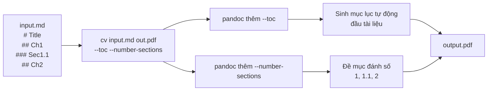
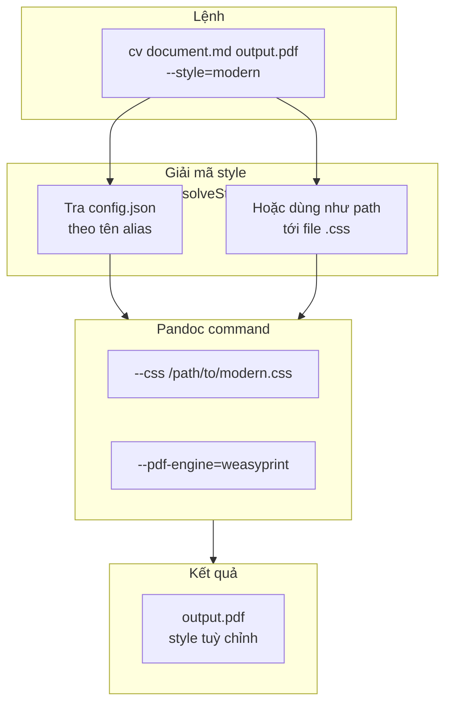
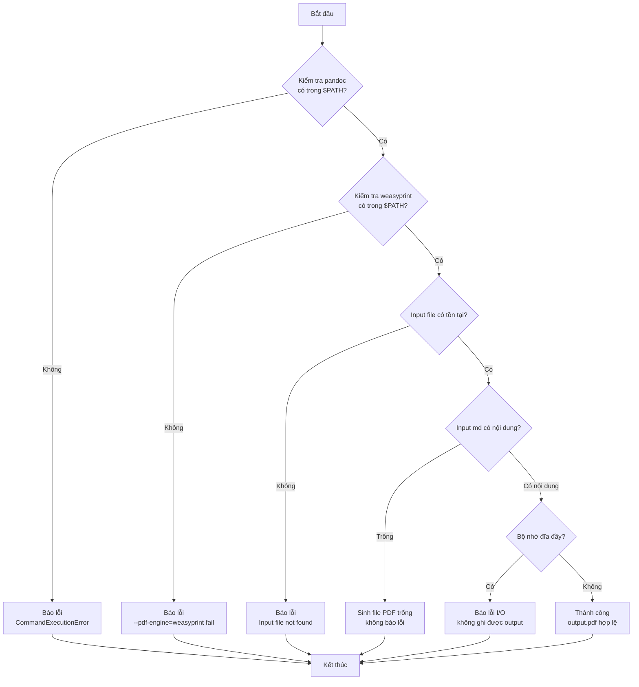
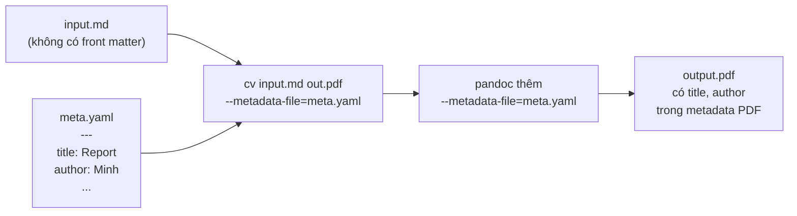
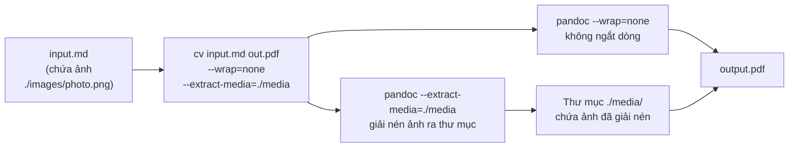

# TEST SPECIFICATION: ZSH COMPLETION FOR `cv` COMMAND (BUG DETECTION)

## 1. Tiền điều kiện & Dữ liệu giả định (Pre-requisites & Mock Data)

Giả định lệnh `cv --list` trả về các route sau:

```plaintext
- md:pdf
- md:docx
- md:html
- docx:html
- docx:md
```

Tạo sẵn các file mẫu trong thư mục: `test1.md`, `test2.docx`, `image.png`, `style.css`

## 2. Kịch bản kiểm thử chi tiết (Test Cases)

### Kịch bản 1: Kiểm thử đối số thứ 1 (Argument 1 - Input File hoặc Subcommand)

- **Mục đích:** Xác minh Zsh lọc đúng các file có đuôi mở rộng hợp lệ dựa trên kết quả của `cv --list`.

| Thao tác (Trình tự gõ) | Kết quả mong đợi (Expected Behavior)                                                                                                       | Trạng thái |
| ---------------------- | ------------------------------------------------------------------------------------------------------------------------------------------ | ---------- |
| Gõ cv [Tab]            | Hiển thị danh sách các file .md, .docx, các flag --dry-run, --list, -h, --help và lệnh init. Không được hiển thị image.png hoặc style.css. |            |
| Gõ cv -[Tab]           | Hiển thị các flag chung: --dry-run, --list, -h, --help.                                                                                    |            |

### Kịch bản 2: Kiểm thử chặn tự đoán Route khi chưa có Output File

- **Mục đích:** Đảm bảo chương trình **không được tự ý đoán** route dựa trên phần tử đầu tiên của cache khi người dùng chưa chỉ định rõ file output.

| Thao tác (Trình tự gõ)  | Kết quả mong đợi (Expected Behavior)                                                                                                                                                                                                       | Trạng thái |
| ----------------------- | ------------------------------------------------------------------------------------------------------------------------------------------------------------------------------------------------------------------------------------------ | ---------- |
| Gõ cv test1.md -[Tab]   | Không được xuất hiện các flag riêng của route md:pdf (--page-size, --toc, v.v.). Chỉ hiển thị các flag chung hoặc không hiển thị gì vì chưa xác định được route đích chính xác. (Hiện tại code cũ đang bị lỗi hiển thị luôn flag của pdf). |            |
| Gõ cv test2.docx -[Tab] | Không được xuất hiện các flag riêng của docx:html (--extract-media).                                                                                                                                                                       |            |

### Kịch bản 3: Kiểm thử gợi ý tên File Output (Argument 2 - Base Name)

- **Mục đích:** Kiểm tra việc tự động lấy tên file input làm template cho file output.

| Thao tác (Trình tự gõ) | Kết quả mong đợi (Expected Behavior)                             | Trạng thái |
| ---------------------- | ---------------------------------------------------------------- | ---------- |
| Gõ cv test1.md [Tab]   | Đề xuất trực tiếp tên file gốc là test1, không hiển thị gì khác. |            |

### Kịch bản 4: Kiểm thử gợi ý Đuôi mở rộng của Output (Argument 2 - Extensions)

- **Mục đích:** Kiểm tra xem hệ thống có lọc đúng các đuôi output được hỗ trợ từ đuôi của input hay không.

| Thao tác (Trình tự gõ)                        | Kết quả mong đợi (Expected Behavior)                                                                                                              | Trạng thái |
| --------------------------------------------- | ------------------------------------------------------------------------------------------------------------------------------------------------- | ---------- |
| Gõ cv test1.md output.[Tab]                   | Hiển thị danh sách đuôi mở rộng hợp lệ cho md gồm: pdf, docx, html. Không được hiển thị md.                                                       |            |
| Gõ cv test1.md output[Tab](không gõ dấu chấm) | Hiển thị danh sách files/folders trong thư mục hiện tại (hành vi `_files` mặc định). Chỉ khi gõ thêm dấu chấm (output.[Tab]) mới gợi ý extension. |            |
| Gõ cv test1.md ~/Deskt[Tab]                   | Đề xuất thư mục `Desktop/`, `Documents/`, `Downloads/` và các file trong `~/`.                                                                    |            |
| Gõ cv test1.md ~/Desktop/output[Tab]          | Đề xuất files/folders có sẵn trong `~/Desktop/`.                                                                                                  |            |
| Gõ cv test1.md ~/Desktop/output.[Tab]         | Hiển thị extension hợp lệ: pdf, docx, html, epub.                                                                                                 |            |

### Kịch bản 5: Kiểm thử hiển thị Flag ĐỘNG dựa vào File Output (Đúng Logic)

- **Mục đích:** Các flag đặc thù của Route **chỉ được phép xuất hiện** sau khi đã xác định rõ cả file Input và file Output trên dòng lệnh.

| Thao tác (Trình tự gõ)                  | Kết quả mong đợi (Expected Behavior)                                                                               | Trạng thái |
| --------------------------------------- | ------------------------------------------------------------------------------------------------------------------ | ---------- |
| Gõ cv test1.md test1.docx -[Tab]        | Xuất hiện các flag riêng của route md:docx: --reference-doc=, --extract-media=, --toc, v.v.                        |            |
| Gõ cv test1.md test1.html -[Tab]        | Xuất hiện các flag riêng của route md:html: --style=, --extract-media=, --toc nhưng không được có --reference-doc. |            |
| Gõ cv test1.md test1.html --style=[Tab] | Hiển thị các alias từ file json (modern, classic) và các file .css trong thư mục hiện hành.                        |            |

### Kịch bản 6: Kiểm thử Edge Cases & Xử lý lỗi (Robustness)

| Thao tác (Trình tự gõ)                                   | Kết quả mong đợi (Expected Behavior)                                                                                          | Trạng thái |
| -------------------------------------------------------- | ----------------------------------------------------------------------------------------------------------------------------- | ---------- |
| Gõ cv --dry-run test1.md [Tab]                           | (Bỏ qua flag --dry-run), nhận diện đúng input là test1.md và gợi ý tiếp tên file output là test1.                             |            |
| Chạy test khi file config.json bị trống hoặc lỗi cú pháp | Gõ cv test1.md test1.html --style=[Tab] vẫn phải chạy bình thường, chỉ hiển thị file local .css chứ không báo lỗi script Zsh. |            |
| Khi lệnh cv --list bị lỗi/không phản hồi                 | Gõ cv [Tab] sẽ fallback về chế độ mặc định: hiển thị tất cả các file (\_files) để không làm gián đoạn terminal.               |            |

### Kịch bản 7: Kiểm thử thay đổi File Output động trên dòng lệnh

- **Mục đích:** Xác minh hệ thống cập nhật chính xác tập hợp flag khi người dùng xóa file output cũ và gõ một file output mới có đuôi khác.

| Thao tác (Trình tự gõ)                                                                  | Kết quả mong đợi (Expected Behavior)                                                                                          | Trạng thái |
| --------------------------------------------------------------------------------------- | ----------------------------------------------------------------------------------------------------------------------------- | ---------- |
| 1. Gõ cv test1.md test1.docx2. Xóa chữ test1.docx, thay bằng test1.pdf3. Gõ thêm -[Tab] | Hệ thống phải chuyển đổi ngữ cảnh từ md:docx sang md:pdf.- Phải xuất hiện: --page-size=- Tuyệt đối biến mất: --reference-doc= |            |

### Kịch bản 8: Kiểm thử nhập đường dẫn File dạng Tuyệt đối/Tương đối (`/path/to/file`)

- **Mục đích:** Đảm bảo hàm tách đuôi mở rộng (`##*.`) và tách tên file (`:t:r`) hoạt động chính xác khi file nằm ở thư mục khác, không bị nhận diện sai route.

| Thao tác (Trình tự gõ)                          | Kết quả mong đợi (Expected Behavior)                                                                                     | Trạng thái |
| ----------------------------------------------- | ------------------------------------------------------------------------------------------------------------------------ | ---------- |
| Gõ cv ../docs/report.md /tmp/target.docx -[Tab] | Hệ thống phải nhận diện chính xác Input đuôi md, Output đuôi docx.- Xuất hiện flag của route md:docx (--reference-doc=). |            |
| Gõ cv ./draft.md [Tab]                          | Hệ thống gợi ý chính xác base name là draft (không chứa thành phần đường dẫn ./).                                        |            |

### Kịch bản 9: Kiểm thử File có nhiều dấu chấm (Multiple Extensions / Dot-files)

- **Mục đích:** Kiểm tra độ bền bỉ của hàm trích xuất đuôi mở rộng đối với các file có cấu trúc tên phức tạp hoặc file ẩn.

| Thao tác (Trình tự gõ)                                              | Kết quả mong đợi (Expected Behavior)                                                              | Trạng thái |
| ------------------------------------------------------------------- | ------------------------------------------------------------------------------------------------- | ---------- |
| Giả sử có file .hidden.mdGõ cv .hidden.md final.version.docx -[Tab] | Hệ thống phải nhận diện đuôi cuối cùng là md và docx.- Xuất hiện đúng các flag của route md:docx. |            |
| Giả sử gõ cv .hidden.md [Tab]                                       | Gợi ý tên file output gốc là .hidden.                                                             |            |

### Kịch bản 10: Kiểm thử chuẩn hóa chữ Hoa/Chữ Thường (Case Insensitivity)

- **Mục đích:** Đảm bảo hệ thống tự động đưa về chữ thường thông qua hàm `_cv_normalize_ext` trước khi tra cứu cache.

| Thao tác (Trình tự gõ)           | Kết quả mong đợi (Expected Behavior)                                                    | Trạng thái |
| -------------------------------- | --------------------------------------------------------------------------------------- | ---------- |
| Gõ cv TEST.MD output.DOCX -[Tab] | Hệ thống nhận diện tương đương md:docx.- Xuất hiện đầy đủ các flag đặc thù của md:docx. |            |
| Gõ cv test1.md OUTPUT.[Tab]      | Vẫn hiển thị danh sách đuôi chữ thường: pdf, docx, html.                                |            |

### Kịch bản 11: Kiểm thử các Flag tiêu thụ đối số (Parameter-consuming flags)

- **Mục đích:** Xác minh các hàm `_cv_find_input` và `_cv_detect_route` bỏ qua chính xác các tham số đứng sau các flag như `--style`, `--metadata-file`, không nhận nhầm các tham số đó làm file Input/Output.

| Thao tác (Trình tự gõ)                                                   | Kết quả mong đợi (Expected Behavior)                                                                                 | Trạng thái |
| ------------------------------------------------------------------------ | -------------------------------------------------------------------------------------------------------------------- | ---------- |
| Gõ cv --style=modern --metadata-file=meta.yaml test1.md test1.pdf -[Tab] | Hệ thống phải bỏ qua modern và meta.yaml. Xác định đúng cặp test1.md và test1.pdf để hiển thị flag riêng của md:pdf. |            |

### Kịch bản 12: Kiểm thử trùng lặp tên flag chung và flag động

- **Mục đích:** Đảm bảo cơ chế gộp mảng `argspec` không tạo ra các flag trùng lặp hoặc xung đột cú pháp hiển thị.

| Thao tác (Trình tự gõ)          | Kết quả mong đợi (Expected Behavior)                                                                                                            | Trạng thái |
| ------------------------------- | ----------------------------------------------------------------------------------------------------------------------------------------------- | ---------- |
| Gõ cv test1.md test1.pdf -[Tab] | Flag --dry-run chỉ xuất hiện đúng 1 lần duy nhất trong danh sách gợi ý (không bị nhân đôi do vừa nằm trong flag chung vừa nằm trong flag động). |            |

### Kịch bản 13: Kiểm thử gõ File không có đuôi mở rộng (Extensionless files)

- **Mục đích:** Đảm bảo khi người dùng truyền vào file không có đuôi (ví dụ file `README` hoặc `LICENSE`), hệ thống không bị crash hoặc sinh route dị dạng `_cv_cache_routes[:]`.

| Thao tác (Trình tự gõ)         | Kết quả mong đợi (Expected Behavior)                                                                  | Trạng thái |
| ------------------------------ | ----------------------------------------------------------------------------------------------------- | ---------- |
| Gõ cv README output.pdf -[Tab] | Hệ thống xác định input ext rỗng "".- Không hiển thị flag động đặc thù nào. Không gây văng lỗi shell. |            |

### Kịch bản 14: Kiểm thử Route hợp lệ nhưng không được định nghĩa Flag riêng

- **Mục đích:** Xác minh hành vi khi bắt được một route hợp lệ từ cache (ví dụ `docx:md`) nhưng route này không nằm trong danh sách kiểm tra của hàm `_cv_route_flags`.

| Thao tác (Trình tự gõ)         | Kết quả mong đợi (Expected Behavior)                                                                                                               | Trạng thái |
| ------------------------------ | -------------------------------------------------------------------------------------------------------------------------------------------------- | ---------- |
| Gõ cv test2.docx out.md -[Tab] | Hệ thống khớp route docx:md. Hàm \_cv_route_flags không trả về gì.- Kết quả: Chỉ hiển thị các flag chung (--dry-run), không báo lỗi cú pháp shell. |            |

### Kịch bản 15: Kiểm thử dọn dẹp biến Cache cục bộ (`local options`)

- **Mục đích:** Đảm bảo việc cấu hình `setopt localoptions extendedglob` và các biến tạm không gây ảnh hưởng đến hoạt động autocomplete của các lệnh khác trong cùng một phiên terminal.

| Thao tác (Trình tự gõ)                                                                                             | Kết quả mong đợi (Expected Behavior)                                                                               | Trạng thái |
| ------------------------------------------------------------------------------------------------------------------ | ------------------------------------------------------------------------------------------------------------------ | ---------- |
| 1. Chạy thực hiện autocomplete với cv vài lần.2. Chuyển sang gõ lệnh khác bất kỳ, ví dụ: ls -[Tab] hoặc git [Tab]. | Lệnh ls hoặc git hiển thị danh sách gợi ý tiêu chuẩn của riêng chúng, không bị lẫn các flag hay biến cache của cv. |            |

### Kịch bản 16: Kiểm thử tốc độ phản hồi khi Cache đã được nạp (Idempotency)

- **Mục đích:** Đảm bảo hàm `_cv_load_routes` hoạt động đúng biến toàn cục `_cv_cache_routes`. Sau lần gọi đầu tiên, hệ thống phải tận dụng cache thay vì gọi lại `cv --list` để tối ưu hiệu năng.

| Thao tác (Trình tự gõ)                                                                                 | Kết quả mong đợi (Expected Behavior)                                                                                                             | Trạng thái |
| ------------------------------------------------------------------------------------------------------ | ------------------------------------------------------------------------------------------------------------------------------------------------ | ---------- |
| Ấn Tab liên tục tại các ngữ cảnh khác nhau (cv [Tab], cv test1.md [Tab], cv test1.md test1.pdf -[Tab]) | Tốc độ hiển thị menu gợi ý phải diễn ra ngay lập tức (< 0.1 giây), không có hiện tượng khựng/lag do phải thực thi lệnh ngầm cv --list nhiều lần. |            |

### Kịch bản 17: Kiểm thử thời gian nạp Cache lần đầu (Cold Cache Latency)

- **Mục đích:** Đo thời gian script thực thi lệnh con `cv --list` để dựng bộ nhớ đệm khi gọi lần đầu tiên.
- **Cách thực hiện:** Xóa biến cache toàn cục, sau đó đo thời gian chạy hàm `_cv_load_routes`.
- **Tiêu chí nghiệm thu:** Thời gian thực thi giây (tùy thuộc vào tốc độ phản hồi của CLI `cv`).

### Kịch bản 18: Kiểm thử tốc độ truy xuất Cache (Hot Cache Latency)

- **Mục đích:** Đảm bảo sau khi cache đã dựng, các lần ấn `Tab` tiếp theo phải phản hồi ngay lập tức mà không gọi lại tiến trình con.
- **Cách thực hiện:** Chạy hàm `_cv_load_routes` liên tục 1000 lần khi cache đã có dữ liệu để đo độ trễ thặng dư.
- **Tiêu chí nghiệm thu:** Tổng thời gian cho 1000 lần gọi giây (xấp xỉ ms cho mỗi lần truy xuất).

### Kịch bản 19: Kiểm thử hiệu năng tìm kiếm Input File (`_cv_find_input`)

- **Mục đích:** Đo tốc độ quét mảng `$words` của Zsh khi dòng lệnh cực kỳ dài hoặc chứa nhiều flag phức tạp.
- **Cách thực hiện:** Giả lập hàng lệnh có 50 từ (bao gồm nhiều flag tiêu thụ tham số) và đo thời gian hàm `_cv_find_input` tìm ra file gốc.
- **Tiêu chí nghiệm thu:** Thời gian xử lý giây để đảm bảo không gây hiện tượng "khựng" terminal khi gõ câu lệnh dài.

### Kịch bản 20: Kiểm thử tần suất gọi lệnh hệ thống ngầm (Subshell Fork Count)

- **Mục đích:** Đảm bảo script không lạm dụng cú pháp `$(...)` bên trong các hàm vòng lặp như `_cv_detect_route`, vì mỗi lần gọi `$(...)` sẽ fork một tiến trình mới làm chậm Zsh.
- **Cách thực hiện:** Đếm số lần hệ thống sinh tiến trình con (Subshell) khi thực hiện toàn bộ luồng gợi ý file output.
- **Tiêu chí nghiệm thu:** Số lần fork = 0 (ngoại trừ lần nạp cold cache đầu tiên từ `cv --list`).

### Kịch bản 21: Kiểm thử rò rỉ bộ nhớ phiên (Memory Leak / Global Pollution)

- **Mục đích:** Đảm bảo script dọn dẹp sạch các biến mảng tạm (`local -a`, `local -A`) sau khi hoàn thành, tránh làm phình bộ nhớ của phiên Zsh hiện tại.
- **Cách thực hiện:** Chạy hàm completion, sau đó kiểm tra xem các biến nội bộ như `argspec`, `valid_outs`, `route` có bị lộ ra môi trường toàn cục hay không.
- **Tiêu chí nghiệm thu:** Các biến tạm phải bị hủy hoàn toàn (`undefined`), chỉ giữ lại duy nhất biến cache `_cv_cache_routes`.

### Kịch bản 22: Kiểm thử stress-test với File cấu hình `config.json` cực lớn

- **Mục đích:** Kiểm tra tốc độ phân rã chuỗi của `jq` khi file cấu hình chứa hàng ngàn alias style.
- **Cách thực hiện:** Tạo file `config.json` giả lập chứa 1000 alias styles khác nhau, sau đó kích hoạt autocomplete tại flag `--style=`.
- **Tiêu chí nghiệm thu:** Menu gợi ý danh sách alias phải hiển thị trong vòng giây.

### Kịch bản 23: Kiểm thử hiển thị danh sách reference-doc

- **Mục đích:** Xác định được các file đã config sẵn của docx.

| Thao tác (Trình tự gõ)                          | Kết quả mong đợi (Expected Behavior)                                                                                                                                                          | Trạng thái |
| ----------------------------------------------- | --------------------------------------------------------------------------------------------------------------------------------------------------------------------------------------------- | ---------- |
| Gõ cv test1.md test1.docx --reference-doc=[Tab] | Xuất hiện các file docx trong thư mục hiện tại, hoặc các file docx đã được cấu hình sẵn trong ~/.config/convert-file/config.json, không được xuất hiện các thư mục con trong thư mục hiện tại |            |
| Gõ cv test1.md test1.html --style=[Tab]         | Xuất hiện các file docx trong thư mục hiện tại, hoặc các file css đã được cấu hình sẵn trong ~/.config/convert-file/config.json, không được xuất hiện các thư mục con trong thư mục hiện tại  |            |

## 4. Kiểm thử Pipeline md:pdf với Mermaid

Các kịch bản dưới đây kiểm thử luồng xử lý thực tế của route `md:pdf` (`src/converters/document.ts` `mdToPdf()`), bao gồm pipeline pandoc + weasyprint, xử lý flag, và các điều kiện lỗi.

### Kịch bản MD-PDF-1: Pipeline cơ bản

- **Mục đích:** Xác minh luồng chuyển đổi md -> pdf cơ bản hoạt động đúng.

```mermaid
flowchart LR
    A[input.md] --> B[pandoc -f markdown -t pdf]
    B --> C{--pdf-engine=weasyprint}
    C --> D[style.css tồn tại?]
    D -- Có --> E[Thêm --css style.css]
    D -- Không --> F[Bỏ qua --css]
    E --> G[Thêm --highlight-style tango]
    F --> G
    G --> H[Thêm -V geometry:margin=2cm]
    H --> I[Thêm -V papersize:a4<br/>(mặc định)]
    I --> J[weasyprint render]
    J --> K[output.pdf]
```

| Bước | Thao tác                         | Kết quả mong đợi                                                       |
| ---- | -------------------------------- | ---------------------------------------------------------------------- |
| 1    | Chạy `cv document.md output.pdf` | Pandoc gọi weasyprint, sinh file `output.pdf`                          |
| 2    | Kiểm tra `output.pdf` tồn tại    | File không rỗng, mở được bằng PDF reader                               |
| 3    | Kiểm tra kích thước trang        | A4 (210x297mm), lề 2cm đều 4 phía                                      |
| 4    | Kiểm tra highlight code          | Code block được tô màu theme tango                                     |
| 5    | Kiểm tra dry-run                 | `cv --dry-run document.md output.pdf` chỉ log command, không sinh file |

### Kịch bản MD-PDF-2: Tuỳ chỉnh kích thước trang (--page-size)

- **Mục đích:** Kiểm tra flag `--page-size` ghi đè đúng giá trị mặc định.

```mermaid
flowchart TB
    subgraph Input["Lệnh"]
        CMD["cv document.md output.pdf<br/>--page-size=letter"]
    end
    subgraph Pipeline["Xử lý flag"]
        D{output có đuôi .pdf?}
        D -- Có --> E[flags.pageSize ??= 'a4'<br/>trong mdToPdf]
        E --> F[flags.pageSize = 'letter'<br/>(từ CLI)]
        F --> G["Thêm -V papersize:letter"]
    end
    subgraph Output["Kết quả"]
        H[output.pdf<br/>định dạng Letter]
    end
    CMD --> Pipeline --> Output
```

| Bước | Thao tác                                    | Kết quả mong đợi                          |
| ---- | ------------------------------------------- | ----------------------------------------- |
| 1    | Chạy `cv doc.md out.pdf --page-size=letter` | Trang PDF khổ Letter (215.9x279.4mm)      |
| 2    | Kiểm tra lề                                 | Vẫn giữ margin=2cm từ `geometry` mặc định |
| 3    | Chạy không flag                             | Mặc định A4                               |

### Kịch bản MD-PDF-3: Mục lục (--toc) và đánh số đề mục (--number-sections)

- **Mục đích:** Kiểm tra flag `--toc` và `--number-sections` hoạt động chính xác.



| Bước | Thao tác                                         | Kết quả mong đợi                                                         |
| ---- | ------------------------------------------------ | ------------------------------------------------------------------------ |
| 1    | Chạy `cv doc.md out.pdf --toc`                   | PDF có trang mục lục ở đầu                                               |
| 2    | Chạy `cv doc.md out.pdf --toc --number-sections` | Mục lục hiển thị số và tiêu đề; heading trong nội dung có số (1, 1.1, 2) |
| 3    | Chạy `cv doc.md out.pdf --no-toc`                | Không có mục lục                                                         |
| 4    | Kiểm tra `--toc --no-toc`                        | Flag sau cùng `--no-toc` ghi đè, không có mục lục                        |

### Kịch bản MD-PDF-4: CSS tuỳ chỉnh (--style)

- **Mục đích:** Kiểm tra flag `--style` nạp CSS tuỳ chỉnh cho PDF.



| Bước | Thao tác                                               | Kết quả mong đợi                                                   |
| ---- | ------------------------------------------------------ | ------------------------------------------------------------------ |
| 1    | Chạy `cv doc.md out.pdf --style=modern`                | Alias `modern` được resolve từ config.json, PDF có style tương ứng |
| 2    | Chạy `cv doc.md out.pdf --style=custom.css`            | File `custom.css` trong CWD được nạp                               |
| 3    | Chạy `cv doc.md out.pdf --style=modern --page-size=a5` | CSS `modern` vẫn dùng cho layout, đồng thời page size là A5        |
| 4    | Kiểm tra không có --style                              | Chỉ dùng default CSS nếu có (style.css trong thư mục module)       |

### Kịch bản MD-PDF-5: Xử lý lỗi và ngoại lệ

- **Mục đích:** Kiểm tra hành vi khi thiếu dependency, input lỗi, output không ghi được.



| Bước | Thao tác                                   | Kết quả mong đợi                                                                                                                       |
| ---- | ------------------------------------------ | -------------------------------------------------------------------------------------------------------------------------------------- |
| 1    | Chạy khi chưa cài weasyprint               | Pandoc báo lỗi `--pdf-engine=weasyprint not found`, script trả về exit code != 0                                                       |
| 2    | Chạy với input không tồn tại               | Lỗi `ENOENT: no such file or directory` từ `runCommand`                                                                                |
| 3    | Chạy với file md trống                     | Pandoc sinh PDF rỗng (0 trang hoặc 1 trang trắng) — không crash                                                                        |
| 4    | Chạy với file md chứa markdown lỗi cú pháp | Pandoc tự sửa lỗi nhẹ (unclosed tag, thiếu space) — sinh PDF vẫn được; lỗi nặng (front matter sai) có thể báo warning nhưng không dừng |

### Kịch bản MD-PDF-6: Kết hợp metadata file (--metadata-file)

- **Mục đích:** Kiểm tra flag `--metadata-file` nạp YAML metadata từ file ngoài.



| Bước | Thao tác                                                     | Kết quả mong đợi                              |
| ---- | ------------------------------------------------------------ | --------------------------------------------- |
| 1    | Tạo `meta.yaml` với `title: "My Report"` và `author: "Test"` |                                               |
| 2    | Chạy `cv doc.md out.pdf --metadata-file=meta.yaml`           | PDF metadata (Title, Author) được set từ YAML |
| 3    | Kiểm tra PDF properties                                      | Title = "My Report", Author = "Test"          |
| 4    | Chạy không --metadata-file                                   | PDF không có metadata tuỳ chỉnh               |

### Kịch bản MD-PDF-7: Flag chồng lấn — --wrap và --extract-media

- **Mục đích:** Kiểm tra các flag không ảnh hưởng đến PDF nhưng không gây lỗi.



| Bước | Thao tác                                             | Kết quả mong đợi                                     |
| ---- | ---------------------------------------------------- | ---------------------------------------------------- |
| 1    | Chạy `cv doc.md out.pdf --wrap=none`                 | PDF không bị ngắt dòng tự động                       |
| 2    | Chạy `cv doc.md out.pdf --extract-media=./out_media` | Ảnh trong md được giải nén ra thư mục `./out_media/` |
| 3    | Chạy với `--wrap=none` và `--toc` cùng lúc           | Cả 2 flag đều được áp dụng, không xung đột           |

## 3. Tiêu chí nghiệm thu (Acceptance Criteria)

- **Pass:** Script vượt qua tất cả các kịch bản, đặc biệt là **Kịch bản 2** (không tự đoán flag khi thiếu file output) và **Kịch bản 5** (hiển thị flag chính xác theo file output đã nhập).
- **Fail:** Script tự động bốc đại một route trong cache để hiển thị flag khi người dùng chưa gõ file đích.

- Bảng tiêu chuẩn các thông số thời gian phản hồi (SLA):

| Chỉ số (Metric)                     | Ngưỡng Tối Ưu (Excellent) | Ngưỡng Chấp Nhận (Acceptable) | Ngưỡng Lỗi (Fail)                    |
| ----------------------------------- | ------------------------- | ----------------------------- | ------------------------------------ |
| Cold Cache (Lần đầu bấm Tab)        | <0.05 giây                | 0.05 - 0.2 giây               | >0.5 giây (Cảm giác bị khựng rõ rệt) |
| Hot Cache (Các lần Tab tiếp theo)   | <0.001 giây               | 0.001 - 0.01 giây             | >0.05 giây                           |
| String Parsing (Quét dòng lệnh dài) | <0.005 giây               | 0.005 - 0.02 giây             | >0.1 giây                            |
| Style Loading (Đọc file JSON)       | <0.02 giây                | 0.02 - 0.1 giây               | >0.2 giây                            |
