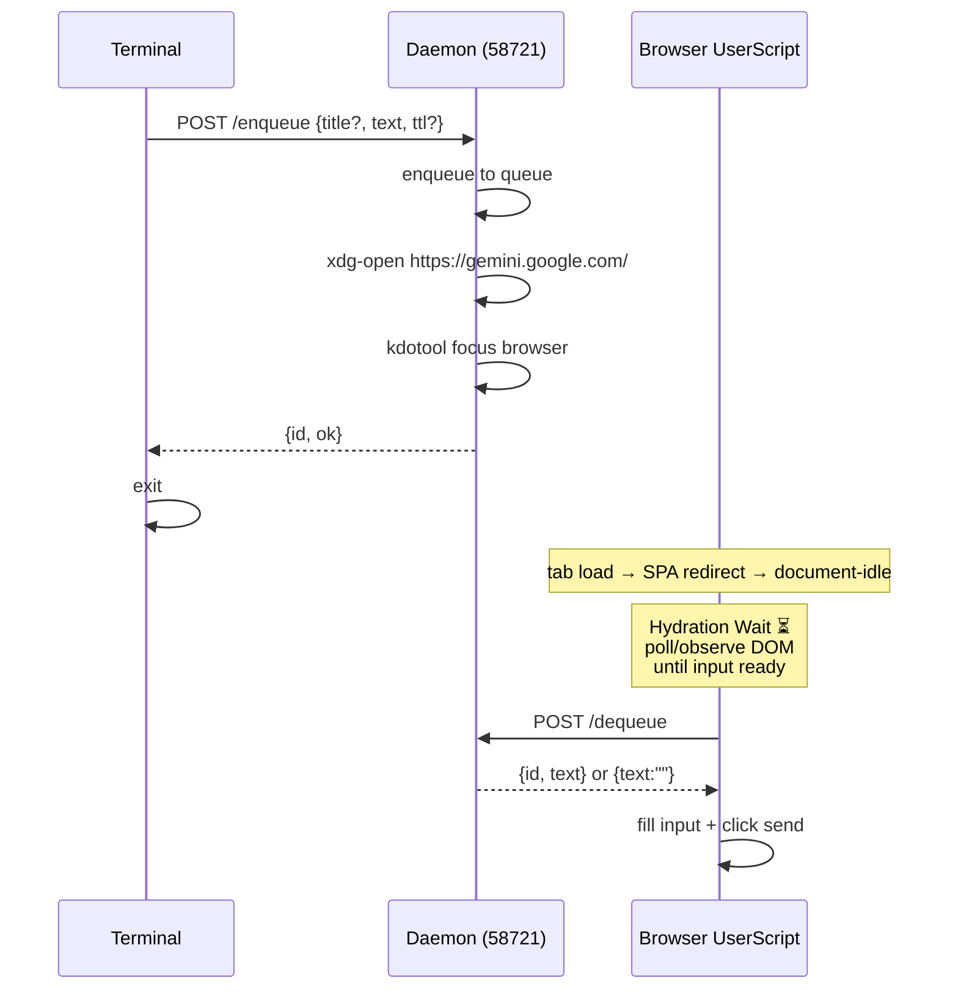
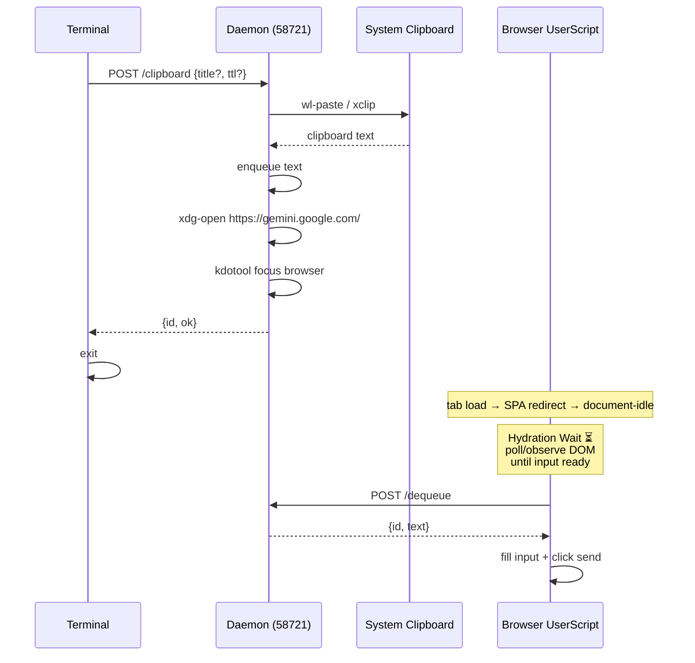
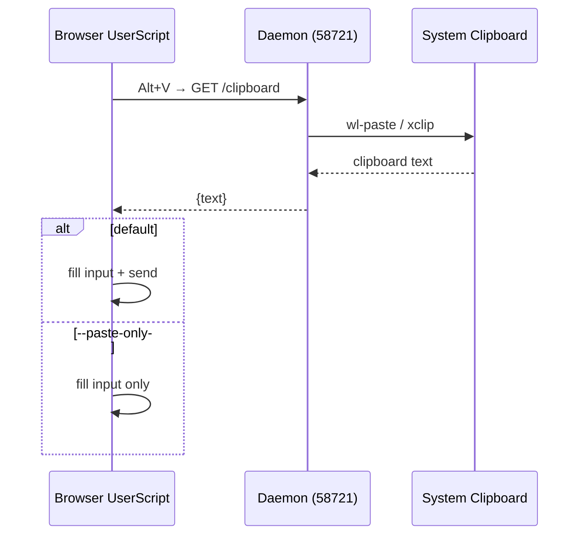
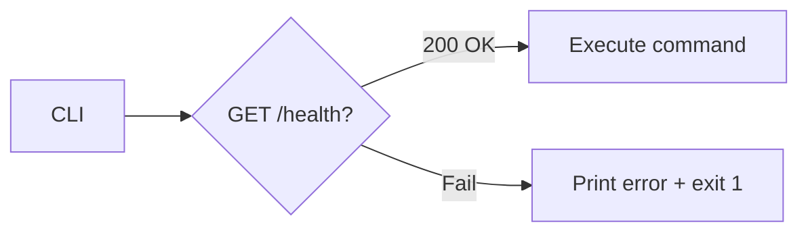
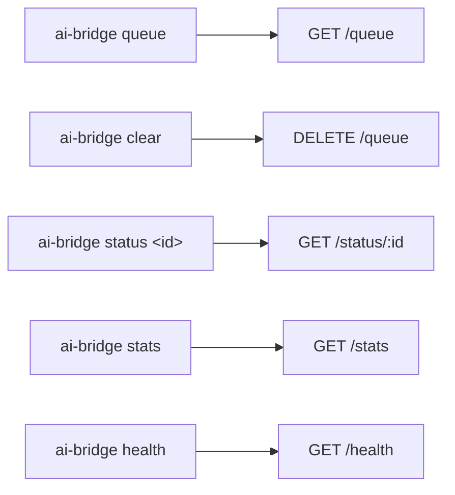

# AI Bridge Daemon — Design Spec

## 1. Purpose

Send prompts from terminal to AI chat web apps (Gemini, ChatGPT, Claude, etc.) via a local daemon + userscript. Solves SPA redirect stripping URL params and non-visible tab throttle delaying script execution. Multi-platform support via pluggable adapter architecture.

## 2. Flows

### 2.1 Queue — Terminal prompt → Gemini



### 2.2 Clipboard CLI — Terminal clipboard → Gemini



### 2.3 Clipboard Browser — Alt+V paste



### 2.4 Daemon Lifecycle



### 2.5 Focus

Focus browser is done automatically in `POST /enqueue` and `POST /clipboard`.

`POST /focus` endpoint is kept — for manual focus (e.g., user wants to bring browser to foreground without enqueuing a new prompt).

### 2.6 Management



## 3. Components

### 3.1 Daemon — `src/daemon/server.ts`

HTTP server on `DAEMON_HOST:DAEMON_PORT` (configurable via `src/config.ts`; defaults `127.0.0.1:58721`).

- **Queue**: in-memory `Map<id, {title, text, createdAt, ttl}>`
- **Cleanup**: lazy — remove expired entries before each read/write
- **Side effects**: after `POST /enqueue` and `POST /clipboard` — open new browser tab via `xdg-open` + focus via `kdotool`

**Endpoints**:

| Method   | Path          | Request                | Response                                       |
| -------- | ------------- | ---------------------- | ---------------------------------------------- |
| `POST`   | `/enqueue`    | `{title?, text, ttl?}` | `{id, ok}`                                     |
| `POST`   | `/dequeue`    | —                      | `{id, text}` or `{text:""}`                    |
| `GET`    | `/queue`      | —                      | `[{id, title, textPreview, remainingTtlMs}]`   |
| `DELETE` | `/queue`      | —                      | `{cleared: count}`                             |
| `GET`    | `/status/:id` | —                      | `{found, expired, text}`                       |
| `GET`    | `/stats`      | —                      | `{uptimeSec, enqueued, dequeued, queueLength}` |
| `POST`   | `/focus`      | —                      | `{ok: true}`                                   |
| `POST`   | `/shutdown`   | —                      | `{ok: true}`                                   |
| `GET`    | `/health`     | —                      | `{alive, queueLength}`                         |
| `POST`   | `/clipboard`  | `{title?, ttl?}`       | `{id, ok}`                                     |
| `GET`    | `/clipboard`  | —                      | `{text}` or `{text:""}`                        |

- `title`: optional, max 200 chars. Default: `"Prompt"`.
- `ttl` in milliseconds. Default: 60000 (60s).
- `text` max length: 100000 chars. Longer → 413.

**Enforcement** (routing layer, before parsing body):

1. Read `Content-Length` header. If > 200KB → 413 immediately, skip body parse.
2. After parsing body, check `text.length > 100000` → 413 with message "Max 100000 characters".

`POST /dequeue` removes **and returns** the oldest non-expired entry (atomic). If empty → `{text:""}`. No claim state, no race on F5/refresh.

#### Clipboard

`POST /clipboard` reads system clipboard and enqueues the text. `GET /clipboard` reads clipboard and returns text directly (no enqueue). Both call the clipboard tool on every request — no cache.

**Display server detection** (per-request, not at startup):

1. `WAYLAND_DISPLAY` set → use `wl-paste` (from `wl-clipboard` package)
2. `WAYLAND_DISPLAY` not set → use `xclip`

If required tool not found → endpoint returns 501 with install instructions.
Other endpoints continue working normally. No daemon crash.

**Timeout**: All clipboard system calls wrapped with 500ms timeout. If command exceeds 500ms → killed, returns empty text, logs warning. Prevents a hanging clipboard process from blocking the HTTP handler.

### 3.2 CLI — `src/cli/index.ts`

CLI is a thin HTTP client — parses args, sends request to daemon at `DAEMON_URL` (imported from `src/config.ts`), prints result, exits.

```bash
ai-bridge "prompt"                 # title="Prompt"
ai-bridge "prompt" -t "my prompt"  # custom title
ai-bridge "prompt" --ttl 120000
echo "prompt" | ai-bridge          # stdin
ai-bridge --ttl 30000 < input.txt  # stdin with TTL
ai-bridge health
ai-bridge status <id>
```

- If no argument given, reads from stdin.
- If both argument and stdin provided, argument takes precedence.
- If text is empty or only whitespace, nothing is enqueued (exit 0).
- Stdin can be combined with `--title`: `echo "prompt" | ai-bridge -t "stdin prompt"`.

**Commands**:

| CLI                                         | Endpoint          | Description                             |
| ------------------------------------------- | ----------------- | --------------------------------------- |
| `ai-bridge "text"`                          | `POST /enqueue`   | Enqueue prompt                          |
| `ai-bridge` (stdin)                         | `POST /enqueue`   | Enqueue from stdin                      |
| `ai-bridge clipboard`                       | `POST /clipboard` | Read clipboard → enqueue                |
| `ai-bridge clipboard --paste-only`          | `POST /clipboard` | Read clipboard → store only, no enqueue |
| `ai-bridge clipboard -t "code" --ttl 30000` | `POST /clipboard` | Clipboard + custom title/TTL            |
| `ai-bridge queue`                           | `GET /queue`      | List pending prompts                    |
| `ai-bridge clear`                           | `DELETE /queue`   | Clear all prompts                       |
| `ai-bridge status <id>`                     | `GET /status/:id` | Track specific prompt                   |
| `ai-bridge stats`                           | `GET /stats`      | Uptime + counters                       |
| `ai-bridge health`                          | `GET /health`     | Check daemon alive                      |
| `ai-bridge focus`                           | `POST /focus`     | Focus browser window                    |
| `ai-bridge server`                          | —                 | Run daemon in foreground (blocking)     |
| `ai-bridge stop`                            | `POST /shutdown`  | Send shutdown request to daemon         |

**Daemon lifecycle**:

- CLI commands require daemon to be running
- If daemon not running: print error `"Daemon not running. Start it with: ai-bridge server"` and exit 1
- `ai-bridge server` runs daemon in foreground (blocking, same process)
- `ai-bridge stop` sends `POST /shutdown` to stop the daemon

**`ai-bridge server`**:

1. Run daemon in foreground (same process, blocking)
2. Import and call `startServer()` from `src/daemon/server.ts`
3. Prints `"ai-bridge daemon listening on {DAEMON_HOST}:{port}"`
4. Ctrl+C or `SIGTERM` triggers graceful shutdown

**`ai-bridge stop`**:

1. Send `POST /shutdown` to daemon
2. Daemon responds `{ok: true}`, then closes HTTP server and exits
3. Poll `/health` until connection refused (timeout 5s)
4. If daemon doesn't stop, exit with error

**Exit codes**: 0 success, 1 error.

### 3.3 UserScript — `userscript/src/`

Tampermonkey script matching `https://gemini.google.com/*` (extensible to other platforms: ChatGPT, Claude, etc.). Built from `src/*.js` modules via `build.mjs` (read `templates/` → inline as JS strings → concat all `src/*.js` → single `user.js`).

**Architecture**: core modules shared across platforms + per-platform adapters. Currently one adapter (Gemini).

**Modules**:

- `config.js` — GM_getValue, GM_setValue, constants. User can override selectors via `GM_setValue('selectors', {...})`.
- `core/bridge.js` — BridgeController (init, port discovery, hydration wait + dequeue on load, periodic dequeue polling, visibilitychange trigger). Platform-agnostic.
- `core/clipboard.js` — Alt+V → `GET /clipboard` handler. Platform-agnostic.
- `core/panel.js` — ChatHistoryPanel (toggle, list, scroll, copy, download). Platform-agnostic, uses adapter for DOM parsing.
- `platforms/gemini.js` — GeminiAdapter: SELECTORS (array of fallback selectors per element), fillInput, getTurnName, getResponseText, getTurnSelector, validateDOM.
- `main.js` — entry point, detect platform → instantiate adapter → init bridge + clipboard + panel.

**Flow**:

- `@run-at document-idle` — wait for SPA redirect to finish
- On start: health check daemon at `DAEMON_URL`/health (URL from `GM_getValue`/`config.js`), save port via `GM_setValue`
- Check URL matches chat pattern (contains `/app` or similar)
- **Hydration Wait**: Poll 100ms + MutationObserver wait for input selector (from adapter) to appear in DOM.
  Timeout 10s → log warning, abort.
- `POST /dequeue` — fetch prompt (atomic read + remove)
- Submit: focus + `execCommand("insertText")` + dispatch `input` + click send
- **Periodic dequeue polling**: After submit, setInterval 1000ms calls `POST /dequeue`
  (pick up new prompts from CLI without reload).
  - Tab visible: interval 500ms
  - Tab hidden: interval 2000ms (avoid throttle)
- **visibilitychange** listener: When `visibilityState === 'visible'` → trigger dequeue immediately
  (combines with kdotool focus from daemon → browser brought to foreground → tab visible → instant dequeue)
- Alt+V → `GET /clipboard` → fill input → send. `--paste-only` flag: fill input only, no send.

### 3.4 Chat History Panel

Float panel fixed top-right. Toggle via `☰` button.

**Layout**:

- Toggle button `☰` fixed top-right, 12px from edge, high z-index
- Click → panel opens below toggle, max-height 60vh, overflow scroll
- Panel header "Chat History" + `✕` close button
- Theme: auto-detect from Gemini UI (CSS variables or class)
- Click outside panel → close

**Turn items**:

- Each turn: response preview (max 80 chars, truncated + `...`) + 📋 button + ⬇ button
- Click item → scroll to that turn in the conversation
  Use stable identifier instead of index: `data-message-id` attribute if DOM has it,
  or adapter-specific selector (`getTurnSelector(index)`) for precise targeting.
- 📋 copy: response text only to clipboard
- ⬇ download: response text only, format `.md`
  - Custom title (≠ "Prompt"): filename = `resolveFilename(title).md`
  - Default title "Prompt": filename from chat turn name (DOM) → `resolveFilename(turnName).md`

`resolveFilename()`: lowercase, spaces→`-`, strip non-alphanumeric (except `-``.`), truncate < 100.

- List live-updates on new turns (MutationObserver)
  **Throttle**: callback wrapped with `requestAnimationFrame` + 300ms throttle.
  Only update Panel UI when AI stops streaming or 300ms after last mutation.
  Avoids re-render hundreds of times per second during streaming.

## 4. File Structure

```
ai-bridge/
├── src/
│   ├── cli/
│   │   ├── index.ts               # CLI entry, parse args
│   │   └── commands/
│   │       ├── enqueue.ts         # text / stdin
│   │       ├── clipboard.ts       # clipboard subcommand
│   │       ├── queue.ts           # list / clear
│   │       ├── status.ts          # status <id>
│   │       ├── stats.ts           # stats
│   │       ├── health.ts          # health
│   │       ├── focus.ts           # focus
│   │       └── daemon.ts          # start / stop (systemd wrapper)
│   ├── daemon/
│   │   ├── server.ts              # HTTP server + routing
│   │   ├── queue.ts               # Queue in-memory logic
│   │   ├── clipboard.ts           # wl-paste / xclip
│   │   ├── focus.ts               # xdg-open + kdotool integration
│   │   └── routes/
│   │       ├── enqueue.ts
│   │       ├── dequeue.ts
│   │       ├── queue.ts
│   │       ├── status.ts
│   │       ├── stats.ts
│   │       ├── health.ts
│   │       ├── focus.ts
│   │       └── clipboard.ts
│   ├── config.ts                  # DAEMON_HOST, DAEMON_PORT, DAEMON_URL (env-driven)
│   ├── health.ts                  # waitForDaemon: poll /health until ready
│   └── utils.ts                   # readStdin, isMain, resolveFilename
├── userscript/
│   ├── src/
│   │   ├── core/
│   │   │   ├── bridge.js          # BridgeService, BridgeController
│   │   │   ├── clipboard.js       # Alt+V handler
│   │   │   └── panel.js           # ChatHistoryPanel (logic only — no HTML/CSS strings)
│   │   ├── platforms/
│   │   │   └── gemini.js          # GeminiAdapter (SELECTORS fallback[], fillInput, getTurnName, getResponseText, getTurnSelector, validateDOM)
│   │   ├── config.js              # GM_get/setValue, constants
│   │   └── main.js                # entry, platform detect → init
│   ├── templates/
│   │   ├── panel.html             # innerHTML for ChatHistoryPanel
│   │   └── panel.css              # styles for panel + toggle button
│   ├── ai-bridge.user.js          # built output (single file for all platforms)
│   ├── build.mjs                  # concat src/*.js + inline templates → user.js
│   └── package.json
├── package.json
└── tsconfig.json
```

## 5. Error Handling

| Case                             | Handling                                                                                                                  |
| -------------------------------- | ------------------------------------------------------------------------------------------------------------------------- |
| Daemon not running               | CLI prints "Daemon not running. Start it with: ai-bridge server" + exit 1                                                 |
| Port 58721 busy                  | Daemon bind error → error logged. User frees port or sets env var                                                         |
| Daemon already running           | `ai-bridge server` prints "ai-bridge already running" + exit 1                                                            |
| Payload > 200KB (Content-Length) | 413, skip body parse                                                                                                      |
| `text` > 100000 chars            | 413 with message "Max 100000 characters"                                                                                  |
| Queue empty                      | `/dequeue` returns `{text:""}` → tab idle                                                                                 |
| TTL expired                      | Entry skipped and cleaned lazily                                                                                          |
| Dequeue before input ready       | Prompt removed but never submitted → loss. Mitigated by hydration wait                                                    |
| `wl-paste`/`xclip` missing       | `/clipboard` returns 501. Daemon continues normally                                                                       |
| Clipboard command timeout        | Killed after 500ms. Returns empty text, logs warning                                                                      |
| Adapter selector fail            | `validateDOM()` logs warning per missing selector. Fallback selectors tried in order. User can override via `GM_setValue` |
| xdg-open not found               | Daemon logs warning, continues without opening tab                                                                        |
| kdotool not found                | Daemon logs warning, continues without focus                                                                              |

## 6. Non-goals

- No persistence (in-memory queue only)
- No auth (localhost-only)
- No mobile/API support
- No multi-daemon

## 7. Dependencies

### Runtime

| Package       | Type    | Purpose                                                                |
| ------------- | ------- | ---------------------------------------------------------------------- |
| `typescript`  | dev     | Compile `src/`                                                         |
| `@types/node` | dev     | Node.js type definitions                                               |
| `tsx`         | runtime | Run `.ts` files directly (no build step for `ai-bridge start` and CLI) |

### System dependencies

| Tool                      | Platform | Required for                                             |
| ------------------------- | -------- | -------------------------------------------------------- |
| `wl-clipboard` (wl-paste) | Wayland  | `POST /clipboard`, `GET /clipboard`                      |
| `xclip`                   | X11      | `POST /clipboard`, `GET /clipboard`                      |
| `xdg-open`                | Linux    | Opening browser tab (`POST /enqueue`, `POST /clipboard`) |
| `kdotool`                 | Linux    | Focusing browser window                                  |
| `tsx`                     | runtime  | Run CLI + daemon (TypeScript execution)                  |

### Not needed

- **HTTP framework** — Node built-in `http.createServer()` is sufficient for a localhost API
- **Body parser** — `req.on('data')` + `JSON.parse()`
- **CORS middleware** — manual `Origin` header check
- **Clipboard libraries** — `child_process.execFile` for `wl-paste`/`xclip`
- **Focus libraries** — `child_process.execFile` for `xdg-open`/`kdotool`

### Optional (future)

| Package               | Purpose                                              |
| --------------------- | ---------------------------------------------------- |
| `commander` / `yargs` | CLI argument parsing if manual parsing grows complex |
