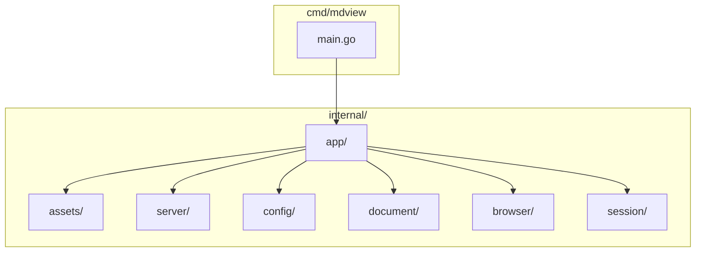

# AGENTS.md - mdview Development Guide

This file provides guidance for autonomous coding agents working on mdview.

## Project Overview

mdview is a Go-based CLI markdown viewer/editor with an embedded JavaScript frontend.
- **Language:** Go 1.24.2
- **Frontend:** Embedded JavaScript/CSS via go:embed
- **Dependencies:** github.com/pelletier/go-toml/v2, github.com/yuin/goldmark

## Build Commands

```bash
# Build all packages
go build ./...

# Build binary
go build -o mdview ./cmd/mdview

# Run the application
./mdview [options] [file]

# Compile and run in one command
go run ./cmd/mdview [options] [file]
```

## Test Commands

```bash
# Run all tests (Go + JS)
go test ./...
node --test internal/assets/web/app-state.test.mjs

# Run single Go test
go test -run TestManagerLoadReturnsDefaultsWhenFileMissing ./internal/config/

# Run tests with verbose output
go test -v ./...

# Run tests for specific package
go test -v ./internal/config/
```

## Code Style Guidelines

### Go

#### Imports
- Standard library first, then external packages
- No blank lines between import groups
- Use implied grouping (no comment separators needed)

```go
import (
    "context"
    "encoding/json"
    "fmt"
    "os"

    "github.com/pelletier/go-toml/v2"
    "github.com/yuin/goldmark"
)
```

#### Naming
- **PascalCase:** Types, functions, methods, interfaces
- **camelCase:** Variables, constants, package names
- **Acronyms:** Max 2 capitals (URL, HTTP, API, ID); avoid all-caps
- **Prefixes:** Use meaningful prefixes for clarity (e.g., `cfg` for config)

#### Types
- Use explicit types rather than type inference for public APIs
- Avoid `interface{}`; use specific interfaces or generics (Go 1.18+)
- Use `any` instead of `interface{}` (Go 1.18+)

#### Error Handling
- Return errors explicitly; avoid silently ignoring with `_`
- Wrap errors with `fmt.Errorf("%w", err)` for context
- Use `errors.Is()` and `errors.As()` for error checking
- Define sentinel errors for expected failure cases

```go
var (
    ErrNotFound    = errors.New("document not found")
    ErrUnauthorized = errors.New("write token required")
)

// Check errors properly
if errors.Is(err, ErrNotFound) {
    // handle not found
}

var parseErr *json.SyntaxError
if errors.As(err, &parseErr) {
    // handle parse error
}
```

#### Context
- Pass `context.Context` as first parameter to functions that may timeout
- Use `context.Background()` when no parent context exists
- Avoid storing context in structs

#### File Permissions
- Use octal notation: `0o755` for executables, `0o644` for regular files
- Never use `0777` or hardcoded secrets

#### Struct Tags
- Use both `toml:` and `json:` tags for configuration fields

```go
type Config struct {
    Browser   string `toml:"browser" json:"browser"`
    Theme     string `toml:"theme" json:"theme"`
    Width    int    `toml:"width" json:"width"`
    FontSize int    `toml:"font-size" json:"font-size"`
}
```

### JavaScript (Frontend)

- **Modules:** Use ES modules (`import`/`export`)
- **Variables:** const/let (no var), camelCase names
- **Functions:** Arrow functions for callbacks
- **Event Listeners:** Use `addEventListener`
- **Async:** Use `async`/`await` for API calls
- **No semicolons:** Follow existing code style (no semicolons)

## Project Structure



```
mdview/
├── cmd/mdview/           # Entry point
│   └── main.go
├── internal/
│   ├── app/             # Application logic
│   │   ├── runtime.go  # Main runtime
│   │   ├── state.go
│   │   ├── input.go
│   │   └── *_test.go
│   ├── assets/
│   │   ├── assets.go   # Embedded assets (go:embed)
│   │   └── web/
│   │       ├── index.html
│   │       ├── app.js
│   │       ├── app-state.js
│   │       ├── app-state.test.mjs
│   │       └── styles.css
│   ├── browser/          # Browser launching
│   ├── config/          # Configuration management
│   ├── document/       # Document handling
│   ├── server/          # HTTP server
│   │   ├── http_test.go
│   │   ├── render_test.go
│   │   └── auth_test.go
│   └── session/        # Session management
├── go.mod
└── go.sum
```

## CLI Options

```bash
mdview [options] [file]

Options:
  -browser string     Browser command (default "xdg-open")
  -theme string        Theme name: warm, minimal, dark, paper (default "warm")
  -appearance string  Appearance: light, dark, system (default "system")
  -width int          Content width in pixels (default 800)
  -font-size int      Font size (default 16)
  -no-sidebar         Start with sidebar hidden
  -edit               Start in edit mode
  -reader             Start in reader mode
  -port int           Listen on specific port (default 0 for random)
  -no-token           Disable write token protection
  -version            Print version
  -help               Show help
```

## Common Development Tasks

### Adding a new configuration option
1. Add field to `internal/config/config.go` Config struct with toml/json tags
2. Add CLI flag in `cmd/mdview/main.go` flag handling
3. Add default in Config.Defaults() if needed
4. Add test in `internal/config/config_test.go`

### Adding a new API endpoint
1. Add handler in appropriate `internal/server/` file
2. Register route with `mux.HandleFunc()`
3. Add authentication check if needed (check token header)
4. Add test in corresponding `*_test.go` file

### Modifying the frontend
1. Edit files in `internal/assets/web/`
2. Rebuild binary: `go build -o mdview ./cmd/mdview`
3. Test in browser

### Running specific test patterns
```bash
# Tests matching prefix
go test -run "^TestConfig" ./...

# Tests in specific package only
go test ./internal/config/ -v

# Tests with coverage
go test -cover ./...
```

## Testing Guidelines

- Use standard Go `testing` package
- Test file naming: `*_test.go`
- Helper functions should end with `_helper` or be unexported
- Use table-driven tests for multiple scenarios
- Clean up resources in defer or t.Cleanup()

```go
func TestManagerLoadReturnsDefaultsWhenFileMissing(t *testing.T) {
    // Arrange
    cfg := &Manager{path: "/nonexistent/config.toml"}

    // Act
    config, err := cfg.Load(context.Background())

    // Assert
    if err != nil {
        t.Fatalf("expected no error, got %v", err)
    }
    if config.Theme != "warm" {
        t.Errorf("expected warm, got %s", config.Theme)
    }
}
```